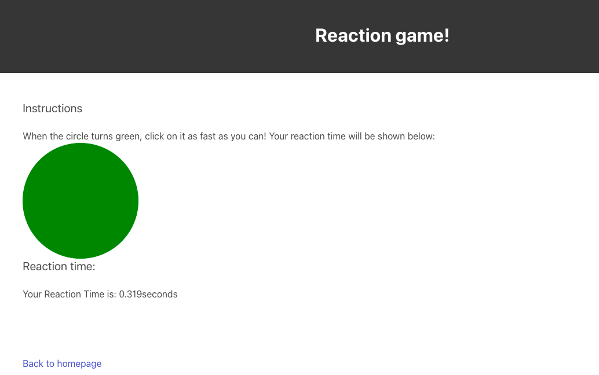

# COMP 426 Final Project - Team finalproject
Members - 
BACKEND LEADS: \
Aubrie Barnhart \
Emma Drew \
Manuela Danso-Fordjour 

FRONT END LEADS: \
Peter Romero \
Xavier Prat Fernandez 

#### a99 Reaction Game
# How does it work?
Our team created a game that tests users' reaction speed by clicking on a circle when it turns green.
We require users to log in or sign up to our website before playing the game to store their information (username, password, and score) in a database and post their scores to a leaderboard. 

## Front End 
The front includes reactionGame.js, game.html, index.html, leaderboards.html, and style.css.
Our main page is our index.html page, which features the ability to either login to your account or sign up for a profile if you don't already have one. Additionally, you can either visit the leaderboard to view other players' top scores or go to the game page to try it for yourself.
## Back End 
The back end includes forms.js, database.js, user.db, and server.js
Our API creates a database of users (user.db) that is managed by our server.js file. Input into this database is linked via our form.js file.
## Dependencies 
Browersync, Bulma

#### Technical Documentation
# HTML & CSS
Our game has three different HTML pages: a homepage (index.html), a leaderboard screen (leaderboards.html), and a page to play the game (game.html). We used bulma to style our website using different classes that we learned from a02 and Bulma documentation (style.css). Additionally, we created a login and sign up function to input people's usernames and passwords for storage in our database.
# Javascript
We used a Javascript file to develop the functionality of our reaction game, as well as three other Javascript files to manage our API database (including server.js, database.js, and form.js).
# API
Our API is managed by three of our Javascript files (database.js, form.js, and server.js). Additionally, we have a database file called user.db that is created upon running the code on a local host).

##### How to Use this Site
1. Clone the A99-FINALPROJECT repository to begin.
2. In visual studio code, you may view many of the files that we have created.
3. In terminal, run the following command: npm install browser-sync
4. Now you should have browser-sync as a dependency in your own repository if you didn't already have it installed. Now, run the following command: npx browser-sync start-sw
5. This should have pulled up our website in a local host, but if it didn't, you may visit this link to view our page: http://localhost:3000/
6. You are now looking at the main page of our website! Your next steps are now up to you:
    a. You may wish to login to an existing account via the Login feature.
    b. ...Or you can create a new account if you don't already have one from the main page.
    c. You can view the leaderboard to see who has achieved the fastest reaction times in the past.
    d. You can play the game yourself!

